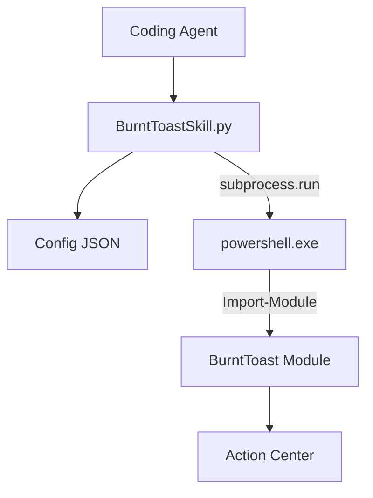

# ⚙️ 仕組みとアーキテクチャ

本スキルが WSL (Linux) 環境から Windows の通知システムを操作するための技術的な詳細を解説します。

---

## 🏗️ 全体構造

---

## 🌐 WSL / Windows 連携

### 1. PowerShell の呼び出し
WSL 環境では `powershell.exe` を通じて Windows 側のバイナリを実行します。本スキルは `PATH` 上にある `powershell.exe` を自動的に探索し、見つからない場合は標準的な WSL のインストールパス (`/mnt/c/...`) をフォールバックとして使用します。

### 2. パス変換 (Path Mapping)
通知に使用するアイコンや画像は、Windows 側からアクセス可能なパスである必要があります。
- **変換ロジック**: `/mnt/c/path/to/icon.png` という WSL パスを、`wslpath -w` を用いて `C:\path\to\icon.png` へ変換します。
- **フォールバック**: `wslpath` が利用できない環境では、単純な文字列置換による変換を行います。

### 3. 文字コード対策 (Encoding)
Windows (Shift-JIS) と Linux (UTF-8) の間で文字化けやデコードエラーが発生しないよう、以下の対策を講じています。
- **出力強制**: PowerShell 実行時に `$OutputEncoding = [Console]::OutputEncoding = [System.Text.Encoding]::UTF8` をセットし、UTF-8 での返却を強制します。
- **柔軟なデコード**: Python 側では UTF-8 でのデコードを試み、失敗した場合は `CP932 (Shift-JIS)` でのリトライとエラー置換 (`replace`) を行います。これにより、日本語環境のエラーメッセージも正しく取得できます。

---

## 🛠️ PowerShell コマンド構築

BurntToast の `New-BurntToastNotification` コマンドに対し、以下の形式で引数を組み立てます。

- **テキスト配列**: `Text` パラメータは、タイトルと本文を一つの配列として渡します。  
  `New-BurntToastNotification -Text 'Title', 'Message'`
- **サウンド指定**: `New-BurntToastNotification` の制約に従い、`Mail`, `Reminder`, `Default` 等の ValidateSet に含まれるキーワードのみを抽出して渡します。
- **ボタン配置**: `New-BTButton` を複数組み合わせ、`-Button (btn1, btn2)` 形式で構築します。

---

## 🔄 進捗バーの更新メカニズム

Windows 通知センターの仕様に基づき、`-UniqueIdentifier` を使用しています。
1. 初回送信時に一意の ID (例: `task_123`) を付与。
2. 更新時、同じ ID を指定して `New-BurntToastNotification` を再送することで、通知がスタックされるのではなく、既存のトーストがその場で書き換わります。
