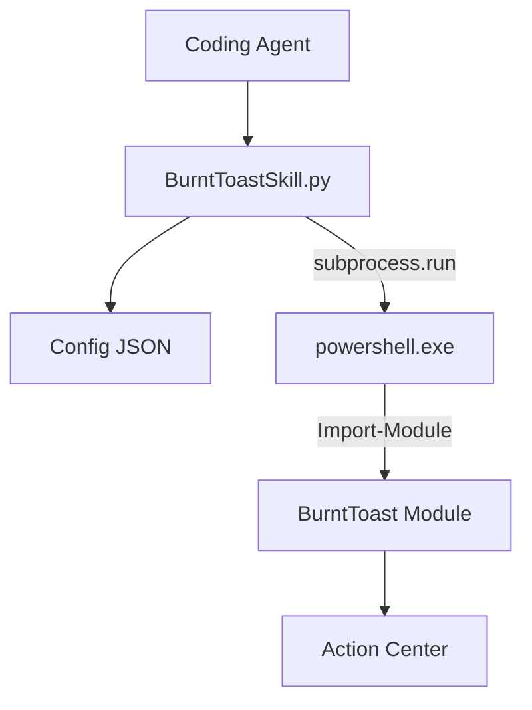

# ⚙️ 技術ガイド: BurntToast 通知スキル

本ドキュメントでは、BurntToast スキルの内部メカニズム、感情表現のマッピング、および技術的な詳細について解説します。

---

## 1. アーキテクチャと連携の仕組み

### 🏗️ 全体構造

### 🌐 WSL / Windows 連携
- **PowerShell 呼び出し**: WSL 環境から `powershell.exe` を通じて Windows 側のバイナリを実行します。`PATH` 上にない場合は、標準的な `/mnt/c/` 以下のパスをフォールバックとして使用します。
- **パス変換 (Path Mapping)**: アイコンや画像は Windows 側からアクセス可能なパスである必要があります。`wslpath -w` を使用して、WSL パスを Windows 形式（`C:\...`）へ変換します。
- **文字コード対策**: Windows (Shift-JIS) と Linux (UTF-8) 間の文字化けを防ぐため、PowerShell 側で UTF-8 出力を強制し、Python 側で柔軟なデコード（UTF-8/CP932）を行います。

---

## 2. 感情表現とテンプレート

エージェントの状態や感情を、視覚（アイコン・絵文字）と聴覚（サウンド）で表現します。

### 🎭 感情マッピング表
デフォルト設定（`burnt_toast_config.json`）による定義：

| 感情 | 絵文字 | サウンド | 特徴 |
| :--- | :---: | :--- | :--- |
| **Success** | ✨ | Mail | 正常完了。安心感を与える軽快な音。 |
| **Error** | ⚠️ | Default | 失敗。**Urgent** フラグで集中モードを突破。 |
| **Warning** | 🔶 | Reminder | 注意。緊急ではないが確認が必要。 |
| **Waiting** | 🔄 | Silent | 処理中。進捗バーで安心感を提供。 |
| **Confirm** | 🤖 | Call | ユーザー判断待ち。着信風レイアウト。 |
| **Info** | 💡 | Default | 一般的なお知らせ。 |

### 🖼️ 視覚的効果
- **Hero Image**: 通知上部に大きな画像を表示。生成物のプレビュー等に使用。
- **UniqueIdentifier**: 通知の ID。同じ ID で再送することで、通知をスタックせずその場で更新（進捗表示に最適）。

---

## 3. 実装上の詳細

### PowerShell コマンド構築
`New-BurntToastNotification` に対して、以下の形式で引数を組み立てます：
- **Text 配列**: タイトルと本文をカンマ区切りの配列として渡します。
- **Sound キーワード**: `Mail`, `Reminder` 等の定義済みキーワードを使用します。
- **ボタン**: `New-BTButton` オブジェクトを構築して渡します。

---

## 4. トラブルシューティング
- **通知が出ない**: Windows 側の「通知設定」や「集中モード」を確認してください。
- **文字化け**: PowerShell のバージョンや、システムロケールが UTF-8 対応を阻害している可能性があります。
- **パスエラー**: WSL2 を使用していること、および画像が `/mnt/c/` 以下にあることを確認してください（WSL1 は非対応です）。
